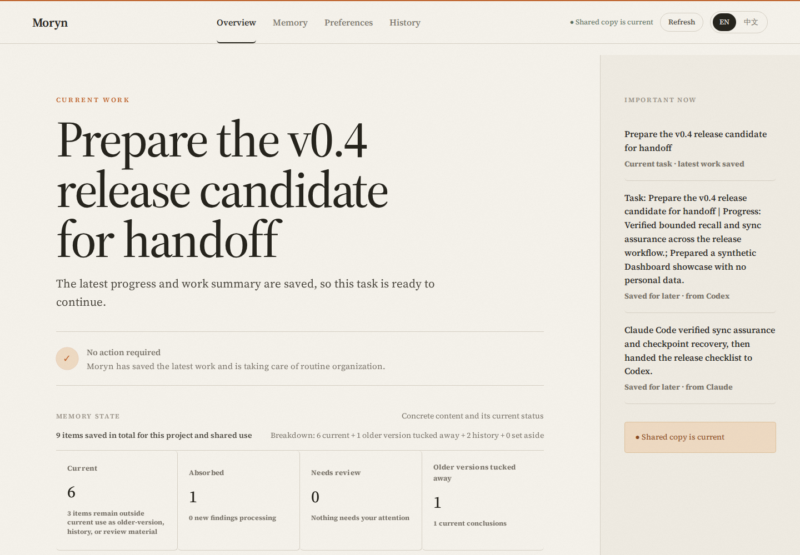
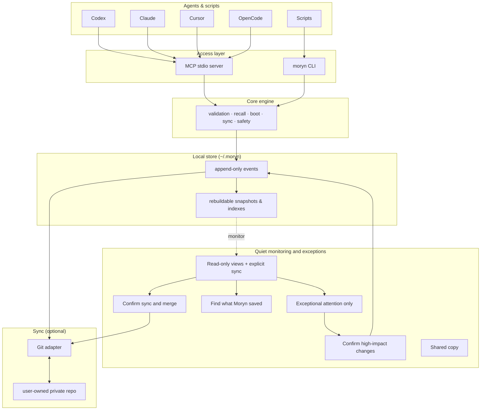

# Moryn


**Local-first, user-owned memory and handoffs for AI agents.**

Moryn lets Codex, Claude Code, Cursor, Gemini, OpenCode, shell agents, and scripts share
durable project context without giving ownership to any one agent vendor.
Agents recall only what fits, hand work to the next agent, and sync through a
private Git repository you control.

**Moryn is a local-first, user-owned, auditable context store and handoff layer
for multi-agent, multi-device AI work.** Every saved item keeps its provenance,
so useful context can move between agents without becoming an opaque cloud
profile.

[](assets/moryn-dashboard-demo.png)

*The real Moryn Dashboard rendered from a synthetic demo store. No personal,
local, or production memory is shown.*

## Why Moryn

- **Continue across agents and devices.** A new session can recover the current
  task, recent decisions, blockers, changed files, and next steps.
- **Keep ownership local.** The runtime store lives on your machine; optional
  sync uses a dedicated private Git repository you control.
- **Keep recall bounded.** Moryn selects the most useful context for the
  available budget instead of replaying an ever-growing transcript.
- **Trace every conclusion.** Records retain source, confidence, state, links,
  and append-only history for inspection and repair.
- **See continuity at a glance.** The Dashboard brings current work, memory
  state, cross-agent handoffs, and sync assurance into one calm view.

Moryn is not an agent platform, not a vector-memory SDK, and not a hosted cloud service.
It is the *memory bus between agents*: simple on the default path, and
fully traceable when someone needs review, provenance, sync, or handoff history.

> Current source/package version: v0.4.0.
>
> Memory Distillation bounds the active working set,
> and Portable Soul versions user/agent identity and prepares it for Codex and
> Claude Code hook output.
> v0.2/v0.3 stores and explicit handoff commands remain compatible.

## What v0.4 adds

Moryn now treats long-lived context as a lifecycle rather than an ever-growing
flat list:

- **Distilled Memory:** L0 evidence, L1 episodes, L2 semantic/procedural
  knowledge, and L3 identity are selected independently from trust and
  hot/warm/cold retention. Session Fold and Episode Rollup compact covered
  history without erasing its provenance.
- **Bounded recall:** deterministic token budgets keep normal boot and retrieval
  bounded. Ranked results remain available, while retrieval diagnostics omit
  the full scanned candidate records and return bounded ranking-pool and
  working-set evidence instead. L3, pinned, and `never_forget` memory remain
  mandatory, with explicit overflow evidence instead of silent truncation.
- **Traceable depth:** a rollup can be expanded to its immediate sources and
  leaf evidence with digest, privacy, conflict, and quarantine checks.
- **Historical recovery:** when bounded current recall is missing or incomplete, Moryn performs
  one bounded, read-only search across cold, archived, logically hidden, and
  working-set-omitted records. Verified useful evidence returns as a compact
  current Learning record; archived sources stay archived and auditable.
  Bounded Chinese/CJK matching supports natural queries without requiring
  whitespace between words.
- **Outcome-aware ranking:** recall remains read-only. After a recall interaction
  ends, a host can explicitly submit exactly one final `recalled`, `used`,
  `verified`, or `rejected` outcome with a unique idempotency key. Moryn stores
  record-level outcome metadata, not the query or answer; useful outcomes improve
  later selection, rejection lowers it, and a plain recall is neutral. Native
  prompt recall returns a `feedback_bridge` with the selected record and
  `memory_feedback` arguments so the host can submit that outcome after use or
  verification completes.
- **Bounded semantic maintenance:** a newly committed checkpoint and
  `agent_finish` can each apply at most one proof-gated, public project merge.
  Idempotent checkpoint replay returns the existing checkpoint without running
  maintenance again.
- **Remembered project aliases:** the first approved Dashboard project repair
  records a directional, portable alias attestation. Later public records under
  that alias are absorbed automatically with exact record-id revisions; private,
  Soul, conflicted, protected-state, unknown, and reverse mappings stay manual.
- **Portable Soul:** User Soul and Agent Persona are versioned separately,
  support global/project clauses and `local_only`/`personal_sync` distribution,
  require approval for activation, and can be rolled back append-only.
- **Truthful hook preparation:** Effective Soul compilation records what was
  selected, and `host_context_prepared` records that bounded context was prepared
  for hook output. Its receipt does not prove stdout transport, Host
  acknowledgment, or model obedience.

Dashboard GET views add read-only Memory Maintenance and Soul Studio
projections; explicit POST actions remain auditable mutations. See the
[v0.4 migration guide](docs/v0.4-migration.md) for compatibility and safety
details.

## Context infrastructure

Moryn also exposes four evidence-first controls for multi-agent engineering:

- **Agent Continuity Protocol v1** negotiates native hooks, MCP, or CLI per
  lifecycle operation and emits content-free conformance receipts. Codex and
  Claude use validated native lifecycle surfaces; OpenCode uses the same
  contract through MCP without pretending its plugin hooks are installed.
- **Repo Atlas** scans Git-tracked metadata into a rebuildable local snapshot,
  binds authored architecture claims to exact file digests, marks claims stale
  after evidence changes, and derives onboarding, request-path, and
  release-impact views.
- **Sync Gate** routes new local-only payloads to an ignored local journal and
  evaluates synchronized events against personal, trusted-team, or public
  destinations before publication.
- **Execution Origin Boundary** marks recalled records and timeline events as
  current-device, remote-device, multi-device, or unknown, so synchronized
  filesystem paths are never silently treated as local paths.

Commands, MCP parity, OpenCode setup, and safety boundaries are documented in
[Context Infrastructure](docs/context-infrastructure.md).

When a prompt exposes a reusable knowledge gap, the agent can queue it without
interrupting the user:

```bash
moryn learn --project . \
  --question "What did we learn?" \
  --conclusion "The supported reusable conclusion." \
  --evidence-type source_code
```

Reliable Learning can enter the durable set automatically only when it agrees
with current memory. A semantic conflict keeps the new Learning as a candidate for
confirmation and excludes the pending conflict from automatic near-duplicate
merging.

When a host knows the final result of using recalled memory, it can record the
outcome explicitly:

```bash
moryn memory feedback <record-id> --outcome used \
  --idempotency-key <recall-interaction-id>
```

The resulting `memory_usage` is a rebuildable, non-semantic projection. It does
not rewrite the record body, logical fingerprint, or compaction summary digest.

Finalization Assurance recovers an unfinalized prior Codex session at the next
startup when durable checkpoint or status evidence exists.

## Default path

The default path is **agent-operated**. An agent enters a project, recalls
bounded context, checkpoints before its context window compacts, restores the
task afterward, captures reliable learnings, and finishes with a synchronized
handoff.

```text
install -> enter/recover -> work/checkpoint -> compact/resume -> finish/sync
```

Dashboard GET views are a quiet, read-only monitoring surface on the normal
path. They show current context, memory flow, sync state, and audit evidence
without writing on refresh. A separate bounded live-server pass may reconcile
only project aliases the user already confirmed; it does not approve new
identity mappings. Dashboard POST mutations accept both direct and
reverse-proxied requests. Deployments that require access restrictions must
provide them at the network or proxy layer.
The Overview may show one explicit `Sync and merge` control when a configured
shared copy is pending or cannot be verified. It confirms the action, commits
only Moryn-managed paths, safely rebases compatible remote history, audits the
result, and pushes without force. Other exceptional confirmation-gated actions
remain isolated in Audit Details.
Users intervene only for exceptional cases: credentials or private
configuration, unresolved sync conflicts, sensitive content, ambiguous project
identity, or materially conflicting long-term memory. The explicit sync control
is an opt-in operational command, not a conflict-repair approval.

Most users should ask an agent to operate Moryn. Deeper reference material is
available in [Agent Workflow](docs/agent-workflow.md),
[Dashboard](docs/dashboard.md), and [Contracts](docs/contracts.md).

## Try the demo

The repository includes a synthetic dogfood demo that creates a temporary
store, exercises the core memory and handoff flow, verifies Dashboard evidence,
and removes the fixture afterward:

```bash
npm run smoke:dogfood-demo
```

This is an executable verification demo rather than a hosted sandbox. The
required Autopilot lifecycle is covered by `npm run smoke:agent-lifecycle`.
Neither smoke touches your real store.

## Use With An Agent

**Use it with an agent (recommended).** Paste this into any agent with shell
access:

```text
Install and use Moryn for this project.

Work autonomously: install Moryn if needed, initialize the local store, attach
this repo as a Moryn project, and register `moryn mcp` if this host supports
MCP. Install `@richardyu114/moryn@0.4.0` from npm and verify `moryn --version`
reports `0.4.0`. When working inside the Moryn source checkout itself, use
`npm install`, `npm run build`, then `npm link` instead.

Do not ask me to choose Moryn commands. Learn the command surface from
`moryn agent guide` and `moryn contracts operations --index`, then decide when
to call `moryn` yourself. Use Moryn for recall, durable memory, status, sync
when configured, and final handoff.

Ask me only for decisions that require my authority or private information:
sync remote URL, credentials, overwriting or repairing configs, ambiguous
project identity, sensitive memory, sync conflicts, or making high-risk memory
long term. Never store secrets.
```

A longer prompt and setup expectations live in
[Agent Install Prompt](docs/agent-install-prompt.md).

**Install from npm:**

```bash
npm install -g @richardyu114/moryn@0.4.0
moryn --version
```

**Or install from source:**

```bash
git clone https://github.com/Richardyu114/Moryn.git
cd Moryn
npm install
npm run build
npm link
moryn --version
```

The executable is `moryn`. Existing v0.2 and v0.3 stores open in place: no
migration command or event-history rewrite is required. After upgrading, run
`moryn health check --project . --host <host>` to verify the local store and
host integration.

## What It Stores

| Kind | What it holds |
| --- | --- |
| `memory` | project facts, decisions, warnings, preferences, active state |
| `skill` | reusable workflows, procedures, command knowledge |
| `soul` | long-term user preferences, collaboration style, principles |
| `session_summary` | final handoff notes from one agent session to the next |
| `agent_note` | raw agent observations that can later be promoted |

Local-first: `~/.moryn` is the runtime store; a user-owned private Git repo is
the first sync backend.

## Host Adapter And Setup

Codex and Claude Code use the native v0.3 Autopilot lifecycle. Compatibility
hosts can use the lower-level handoff commands.

```bash
moryn setup --host codex --project .
moryn setup --host codex --project . --apply
moryn install --host codex --project . --apply
moryn install --host codex --project . --apply --activate-host
moryn install --host claude --project . --apply --activate-host
moryn agent enter --project . --agent codex --session-id "<session-id>" --device-id "<device-id>" --current-task "<current task>"
moryn agent finish --project . --agent codex --session-id "<session-id>" --device-id "<device-id>" --summary "<concise handoff>"
```

`moryn setup` is a local, auditable setup wizard. Run setup once without
`--apply` first; it prints checks and planned local writes without changing
files. Apply only after the dry-run looks right. The dry-run lists planned local
writes with exact paths; apply initializes only the Moryn store and project
config and does not edit host configuration files.

`moryn install --apply` follows the same local-only boundary. Editing Codex or
Claude Code configuration requires the separate `--activate-host` flag. For
unattended checks and repair planning, use `moryn automation status` and
`moryn automation reconcile`; reconcile is a dry-run unless `--apply` is set,
and host repair still requires `--activate-host`.

The lower-level `moryn context pack` remains available and returns Handoff Pack v0.2
with the current goal, recent decisions, open threads, risks, preferences,
important files, and next actions. `moryn capture session` evaluates
`default_autocapture_policy`; repeated `--file <path>` flags preserve touched-file evidence.
Low-risk handoffs are auto-captured as local evidence, while risky or
durable handoffs enter Capture Inbox. Reliable low-risk project learnings may
become canonical automatically under the documented state policy.

## Architecture



Event history is the source of truth. Snapshots and indexes are derived and can
be rebuilt at any time with `moryn rebuild`.

## Safety model

Records move through explicit states, so source material never silently becomes
trusted shared memory:

```text
raw ──> candidate ──> canonical
                  └──> archived
                  └──> quarantined
```

- `raw` — source material, hidden by default
- `candidate` — potentially useful, not yet trusted
- `canonical` — durable context, returned by default
- `archived` — preserved history, hidden by default
- `quarantined` — sensitive or unsafe, hidden by default

Records classified private by a `private`/`secret`/`sensitive` tag,
`content.privacy: "private"`, or `content.distribution: "local_only"` are
excluded from normal reads (`boot`, `recall`, `refresh`, `timeline`,
doctor/lifecycle reports, and the dashboard). Unified compaction preview also
excludes private-classified sources by default and returns
a count-only, non-applicable omission blocker when they are present in the
requested scope. Pass `--include-private` (or MCP `include_private: true`) only
with explicit user intent. New `local_only` memory is written to an ignored
local event journal and merged into local read models without entering the Git
publication tree. Existing bytes already published by older versions are not
rewritten or claimed to be erased. High-risk canonical writes require
confirmation.

**Capture Inbox** is the exceptional human-review path. Low-risk handoffs are
auto-captured as local evidence without a click; risky or durable decisions go
to the inbox for approve/reject; obvious smoke/test or duplicate captures are
archived with policy evidence. The inbox never rewrites history or silently
approves the high-impact items it receives.

## Connecting agents (MCP)

```bash
moryn mcp                                  # start the stdio server
codex mcp add moryn -- moryn mcp           # Codex CLI
gemini mcp add moryn moryn mcp --scope project  # Gemini CLI
```

Generic MCP host config:

```json
{ "mcpServers": { "moryn": { "command": "moryn", "args": ["mcp"] } } }
```

OpenCode can configure the same local command in `opencode.json` under
`mcp`; see [Context Infrastructure](docs/context-infrastructure.md#opencode).
Codex and Claude Code are the validated native Autopilot integrations; other
hosts use MCP plus explicit lifecycle commands. See
[Agent Workflow](docs/agent-workflow.md) for the full lifecycle.

## Git sync

Sync is optional and must use a **dedicated private repo** — never the source
code repo:

```bash
moryn sync init git@github.com:yourname/moryn-store.git
```

`config.json`, `.moryn/`, `snapshots/`, `indexes/`, `state/`, and
`state/local-events/` are local-only. Synchronized event history plus the
local event overlay form the local source of truth; derived views rebuild via
`moryn rebuild`. Sync fails closed if local or remote reachable history ever
contained one of those local-only paths: deleting it from the current tip does
not erase the earlier Git blob.

## Dashboard

A local-first browser view of sync state, records, recent events, and agent
activity:

```bash
moryn dashboard --serve --host 127.0.0.1 --port 8765 --project-id moryn
moryn dashboard --serve --host 127.0.0.1 --port 8765 --project-id moryn --readiness-host codex --no-open
moryn dashboard service install --host 127.0.0.1 --port 8765 --limit 20 --project-id moryn
moryn dashboard service status
```

It rebuilds from event history on each refresh and also exposes `/api/dashboard`
(JSON). `moryn dashboard --no-open` writes a static
`state/dashboard/index.html` snapshot (not synced). When a project is set, it
adds read-only handoff-readiness (Context Pack Review) and, for exceptional
cases, a local Review Queue and Capture Inbox for approving append-only repair,
migration, or promotion events. Full details:
[Dashboard](docs/dashboard.md).

The `context_pack_review` report provides read-only handoff readiness. It also
distinguishes auto-captured local evidence from items that require a decision.

In a shared environment, report the deployment-specific dashboard URL, for
example `<dashboard-url>`. `127.0.0.1:8765` is the internal server bind target,
not necessarily the human-facing address. Static output remains at
`state/dashboard/index.html`; see `docs/dashboard.md` for access modes.

On Linux, `dashboard service install` creates and enables a restartable systemd
user service with the exact Node runtime, CLI entry point, store, bind, project,
refresh, and limit arguments. `status`, `restart`, and `repair` return stable
JSON receipts suitable for automation.
MCP clients use `dashboard_service_status`, `dashboard_service_install`,
`dashboard_service_restart`, and `dashboard_service_repair`; mutating service
tools require `confirm: true`.

## Command surface

Agents should discover commands at runtime rather than memorize them:

```bash
moryn agent guide
moryn contracts operations --index
moryn contracts operations --operation agent_enter
moryn contracts selection-sources
```

The read-only inspection commands (all safe, none mutate memory):

| Command | Purpose |
| --- | --- |
| `moryn timeline --record-id <id>` | chronological neighbors + recall next actions |
| `moryn memory doctor` | candidate backlog, promotable records, marker noise, split project ids |
| `moryn memory shadow` | whole-working-set merge candidates + read-only before/after size forecast |
| `moryn memory lifecycle` | classify records: retained / stale / archive candidate |
| `moryn memory expand <record_id>` | bounded, digest-aware source and leaf-evidence expansion |
| `moryn soul status` | metadata-only profile, revision, compilation, and hook-preparation status |
| `moryn capture policy` | audit what autocapture already decided |
| `moryn dogfood report` | capture backlog, duplicate handoffs, failure/timeout signals |
| `moryn health check` | store readiness, replay, project context, MCP freshness |
| `moryn automation status` | compact keyed readiness checks without writes |
| `moryn automation reconcile` | dry-run repair plan; `--apply` gates local writes |
| `moryn list-recent --project .` | bounded recent records for one project |
| `moryn eval recall` | recall quality against golden queries |
| `moryn project migrate` | preview + apply auditable project-id migration |

Soul authoring is deliberately separate from read-only status. `moryn soul
draft` persists an unapproved revision; `moryn soul approve <revision_id>
--confirm` and `moryn soul rollback --profile-id <id> --to-revision <revision_id>
--confirm` require explicit confirmation and append receipts. The draft response
is the authoring review boundary. CLI status remains metadata-only; the
Dashboard's dedicated Collaboration Preferences view may render only selected
`personal_sync` text for the current project, while `local_only` text always
stays hidden.

Projects can select their normal approved User/Agent profiles and bounded
delivery budgets in `.moryn.json`:

```json
{
  "project_id": "moryn",
  "soul": {
    "user_profile_id": "soul_profile_...",
    "agent_profile_id": "soul_profile_...",
    "char_budget": 4096,
    "token_budget": 1024
  }
}
```

Explicit `agent start`/`agent enter` profile and Soul-budget arguments override
these fallback values for one call without rewriting project config. Automatic
`SessionStart` hooks use the project binding both at startup and after compaction
when the Host reports `source=compact`. Generated integrations do not install a
`PostCompact` handler; an older Moryn-owned handler is a silent no-op. Automatic
lifecycle hooks keep their transactions local and leave remote publication to
the Dashboard sync action or an explicit `moryn sync` command. Direct
`agent start`, `agent status`, and `agent finish` calls retain their normal sync
defaults. See
[Portable Soul Workflow](docs/agent-workflow.md#v04-portable-soul-workflow) for
the exact CLI/MCP argument mapping and safety rules.

For installation trust, the read-only `health_check` operation reports store
replay, project context, privacy boundaries, MCP freshness, and setup readiness:

```bash
moryn health check --project . --host codex --sync-remote <remote> --limit 20
```

It checks the installation without changing host configuration files. For
recall quality, the read-only `recall_eval` operation reports matched, missing,
and hidden expected record ids. Hidden ids mean the record exists but normal
recall filters kept it out. Its `inspect_hidden_expected_records` action remains
read-only; Recall Eval uses normal recall with no embedding index and does not
mutate memory.

Suggested mutating actions stay `safe_to_run: false` until you confirm. Each has
a matching MCP tool. See [Contracts](docs/contracts.md) for operation contracts,
selection-source paths, and recovery metadata.

Automation can put a global operation deadline before the command, for example
`moryn --timeout-ms 30000 write ...`. Retriable mutations accept
`--idempotency-key <key>` and return `committed`, `idempotent_replay`,
durability, derived-view status, and warnings. MCP responses retain their
legacy text while also returning `structuredContent.outcome` with `status`,
`committed`, `retryable`, and an optional `next_action`.

## Documentation

- [Agent Install Prompt](docs/agent-install-prompt.md) — copy-paste setup
- [Agent Workflow](docs/agent-workflow.md) — the lifecycle protocol
- [Dashboard](docs/dashboard.md) — endpoints, access modes, troubleshooting
- [Contracts](docs/contracts.md) — machine-readable operation contracts
- [Design Spec](docs/moryn-design.md) — full protocol design
- [Implementation Roadmap](docs/implementation-roadmap.md)
- [Development](docs/development.md) · [Changelog](CHANGELOG.md)

## Development

```bash
npm install
npm run build
npm run typecheck
npm test
npm run release:check
```

The smoke suite covers the acceptance paths — Autopilot lifecycle, dogfood loop,
v0.2 upgrade compatibility, and sync/permission resilience:

```bash
npm run smoke:agent-lifecycle       # v0.3 Autopilot acceptance
npm run smoke:dogfood-demo          # setup, context-pack, policy, dashboard
npm run smoke:upgrade-compat        # open a frozen v0.2 store in place
npm run smoke:sync-resilience       # remote outage never loses the handoff
npm run smoke:sync-conflict         # real Git conflict halts and waits for human
npm run smoke:permission-recovery   # auth failure stays local-first, resumes later
```

`release:check` builds, typechecks, tests, checks packed-package contents, and
optionally validates a private Git remote:

```bash
MORYN_PRIVATE_GIT_REMOTE=git@github.com:yourname/moryn-store-release-test.git npm run release:check
```

Use a dedicated test data repo — validation writes a test event to the remote.
More detail: [Development](docs/development.md).

## License

MIT
