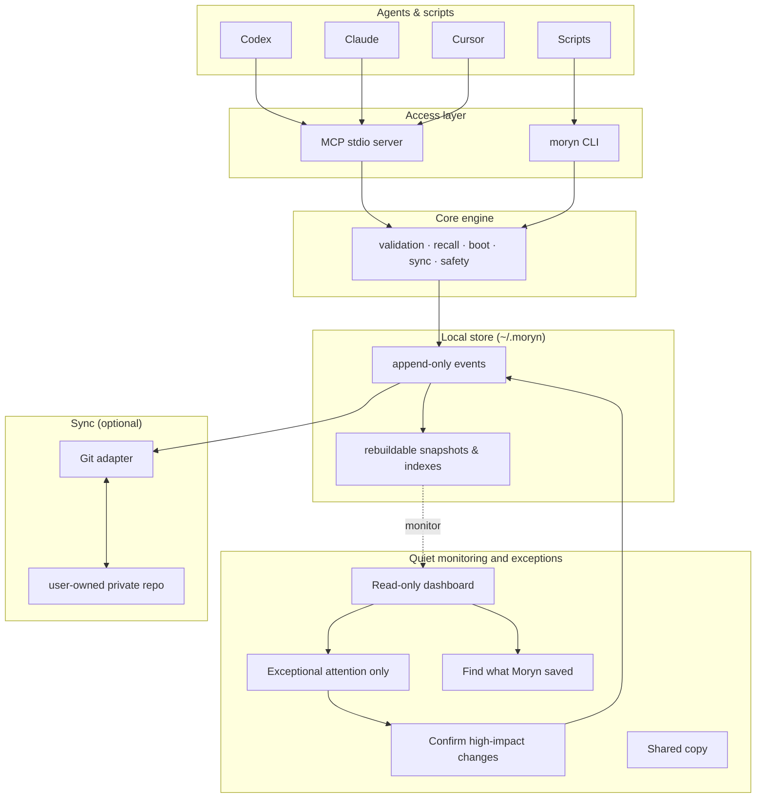

# Moryn


**Moryn is a local-first, user-owned, auditable context store and handoff layer for
multi-agent, multi-device AI work.**

Codex, Claude, Cursor, Gemini, shell agents, and scripts share one durable
context store — without memory belonging to any single agent. The user owns the
store. Agents recall context, hand work to the next agent, sync through a
user-owned private Git repo, and every saved item shows exactly where it came
from.

Moryn is not an agent platform, not a vector-memory SDK, and not a hosted cloud service.
It is the *memory bus between agents*: simple on the default path, and
fully traceable when someone needs review, provenance, sync, or handoff history.

> Current source/package version: v0.4.0-dev.0. v0.4 is still in active development and has not been tagged or published.
>
> Memory Distillation bounds the active working set,
> and Portable Soul versions user/agent identity and prepares it for Codex and
> Claude Code hook output.
> v0.2/v0.3 stores and explicit handoff commands remain compatible.

## What is being built for v0.4

Moryn now treats long-lived context as a lifecycle rather than an ever-growing
flat list:

- **Distilled Memory:** L0 evidence, L1 episodes, L2 semantic/procedural
  knowledge, and L3 identity are selected independently from trust and
  hot/warm/cold retention. Session Fold and Episode Rollup compact covered
  history without erasing its provenance.
- **Bounded recall:** deterministic token budgets keep normal boot and retrieval
  bounded. L3, pinned, and `never_forget` memory remain mandatory, with explicit
  overflow evidence instead of silent truncation.
- **Traceable depth:** a rollup can be expanded to its immediate sources and
  leaf evidence with digest, privacy, conflict, and quarantine checks.
- **Portable Soul:** User Soul and Agent Persona are versioned separately,
  support global/project clauses and `local_only`/`personal_sync` distribution,
  require approval for activation, and can be rolled back append-only.
- **Truthful hook preparation:** Effective Soul compilation records what was
  selected, and `host_context_prepared` records that bounded context was prepared
  for hook output. Its receipt does not prove stdout transport, Host
  acknowledgment, or model obedience.

The dashboard adds read-only Memory Maintenance and Soul Studio views. See the
[v0.4 migration guide](docs/v0.4-migration.md) for compatibility and safety
details.

When a prompt exposes a reusable knowledge gap, the agent can queue it without
interrupting the user:

```bash
moryn learn --project . \
  --question "What did we learn?" \
  --conclusion "The supported reusable conclusion." \
  --evidence-type source_code
```

Finalization Assurance recovers an unfinalized prior Codex session at the next
startup when durable checkpoint or status evidence exists.

## Default path

The default path is **agent-operated**. An agent enters a project, recalls
bounded context, checkpoints before its context window compacts, restores the
task afterward, captures reliable learnings, and finishes with a synchronized
handoff.

```text
install -> enter/recover -> work/checkpoint -> compact/resume -> finish/sync
```

The dashboard is a quiet, read-only monitoring surface on the normal path. It
shows health, current context, memory flow, sync state, and audit evidence.
Users intervene only for exceptional cases: credentials or private
configuration, unresolved sync conflicts, sensitive content, ambiguous project
identity, or materially conflicting long-term memory.

Most users should ask an agent to operate Moryn. Deeper reference material is
available in [Agent Workflow](docs/agent-workflow.md),
[Dashboard](docs/dashboard.md), and [Contracts](docs/contracts.md).

## Try the demo

From a source checkout:

```bash
npm run smoke:dogfood-demo
```

The demo exercises storage, context, capture policy, and dashboard evidence on
a temporary store. The required Autopilot lifecycle is covered by
`npm run smoke:agent-lifecycle`. Neither smoke touches your real store.

## Use With An Agent

**Use it with an agent (recommended).** Paste this into any agent with shell
access:

```text
Install and use Moryn for this project.

Work autonomously: install Moryn if needed, initialize the local store, attach
this repo as a Moryn project, and register `moryn mcp` if this host supports
MCP. Until v0.4 is published to npm, use the source repo at
https://github.com/Richardyu114/Moryn (`npm install`, `npm run build`, then
`npm link`) and verify `moryn --version` reports `0.4.0-dev.0`. Do not assume an
unpinned npm install contains v0.4.

Do not ask me to choose Moryn commands. Learn the command surface from
`moryn agent guide` and `moryn contracts operations --index`, then decide when
to call `moryn` yourself. Use Moryn for recall, durable memory, status, sync
when configured, and final handoff.

Ask me only for decisions that require my authority or private information:
sync remote URL, credentials, overwriting or repairing configs, ambiguous
project identity, sensitive memory, sync conflicts, or making high-risk memory
long term. Never store secrets.
```

A longer prompt and setup expectations live in
[Agent Install Prompt](docs/agent-install-prompt.md).

**Install manually:**

```bash
npm install -g @richardyu114/moryn@0.4.0  # npm target after publication
# or from source:
git clone https://github.com/Richardyu114/Moryn.git
cd Moryn && npm install && npm run build && npm link
```

The executable is `moryn`. Existing v0.2 and v0.3 stores open in place: no
migration command or event-history rewrite is required. After upgrading, run
`moryn health check --project . --host <host>` to verify the local store and
host integration.

## What It Stores

| Kind | What it holds |
| --- | --- |
| `memory` | project facts, decisions, warnings, preferences, active state |
| `skill` | reusable workflows, procedures, command knowledge |
| `soul` | long-term user preferences, collaboration style, principles |
| `session_summary` | final handoff notes from one agent session to the next |
| `agent_note` | raw agent observations that can later be promoted |

Local-first: `~/.moryn` is the runtime store; a user-owned private Git repo is
the first sync backend.

## Host Adapter And Setup

Codex and Claude Code use the native v0.3 Autopilot lifecycle. Compatibility
hosts can use the lower-level handoff commands.

```bash
moryn setup --host codex --project .
moryn setup --host codex --project . --apply
moryn install --host codex --project . --apply
moryn install --host claude --project . --apply
moryn agent enter --project . --agent codex --session-id "<session-id>" --device-id "<device-id>" --current-task "<current task>"
moryn agent finish --project . --agent codex --session-id "<session-id>" --device-id "<device-id>" --summary "<concise handoff>"
```

`moryn setup` is a local, auditable setup wizard. Run setup once without
`--apply` first; it prints checks and planned local writes without changing
files. Apply only after the dry-run looks right. The dry-run lists planned local
writes with exact paths; apply initializes only the Moryn store and project
config and does not edit host configuration files.

The lower-level `moryn context pack` remains available and returns Handoff Pack v0.2
with the current goal, recent decisions, open threads, risks, preferences,
important files, and next actions. `moryn capture session` evaluates
`default_autocapture_policy`; repeated `--file <path>` flags preserve touched-file evidence.
Low-risk handoffs are auto-captured as local evidence, while risky or
durable handoffs enter Capture Inbox. Reliable low-risk project learnings may
become canonical automatically under the documented state policy.

## Architecture



Event history is the source of truth. Snapshots and indexes are derived and can
be rebuilt at any time with `moryn rebuild`.

## Safety model

Records move through explicit states, so source material never silently becomes
trusted shared memory:

```text
raw ──> candidate ──> canonical
                  └──> archived
                  └──> quarantined
```

- `raw` — source material, hidden by default
- `candidate` — potentially useful, not yet trusted
- `canonical` — durable context, returned by default
- `archived` — preserved history, hidden by default
- `quarantined` — sensitive or unsafe, hidden by default

Records classified private by a `private`/`secret`/`sensitive` tag,
`content.privacy: "private"`, or `content.distribution: "local_only"` are
excluded from normal reads (`boot`, `recall`, `refresh`, `timeline`,
doctor/lifecycle reports, and the dashboard). Unified compaction preview also
excludes private-classified sources by default and returns
a count-only, non-applicable omission blocker when they are present in the
requested scope. Pass `--include-private` (or MCP `include_private: true`) only
with explicit user intent. For ordinary memory, `local_only` is a read
authorization marker and does not prevent the append-only event from following
the store's configured Git sync; Soul clause distribution is the separate
portable-projection boundary. High-risk canonical writes require confirmation.

**Capture Inbox** is the exceptional human-review path. Low-risk handoffs are
auto-captured as local evidence without a click; risky or durable decisions go
to the inbox for approve/reject; obvious smoke/test or duplicate captures are
archived with policy evidence. The inbox never rewrites history or silently
approves the high-impact items it receives.

## Connecting agents (MCP)

```bash
moryn mcp                                  # start the stdio server
codex mcp add moryn -- moryn mcp           # Codex CLI
gemini mcp add moryn moryn mcp --scope project  # Gemini CLI
```

Generic MCP host config:

```json
{ "mcpServers": { "moryn": { "command": "moryn", "args": ["mcp"] } } }
```

Codex and Claude Code are the validated v0.3 Autopilot integrations; other hosts
use MCP plus explicit lifecycle commands. See
[Agent Workflow](docs/agent-workflow.md) for the full lifecycle.

## Git sync

Sync is optional and must use a **dedicated private repo** — never the source
code repo:

```bash
moryn sync init git@github.com:yourname/moryn-store.git
```

`config.json`, `.moryn/`, `snapshots/`, `indexes/`, and `state/` are local-only;
event history is the source of truth and derived views rebuild via `moryn
rebuild`. Sync fails closed if local or remote reachable history ever contained
one of those local-only paths: deleting it from the current tip does not erase
the earlier Git blob.

## Dashboard

A local, read-only browser view of sync state, records, recent events, and agent
activity:

```bash
moryn dashboard --serve --host 127.0.0.1 --port 8765 --project-id moryn
moryn dashboard --serve --host 127.0.0.1 --port 8765 --project-id moryn --readiness-host codex --no-open
```

It rebuilds from event history on each refresh and also exposes `/api/dashboard`
(JSON). `moryn dashboard --no-open` writes a static
`state/dashboard/index.html` snapshot (not synced). When a project is set, it
adds read-only handoff-readiness (Context Pack Review) and, for exceptional
cases, a local Review Queue and Capture Inbox for approving append-only repair,
migration, or promotion events. Full details:
[Dashboard](docs/dashboard.md).

The `context_pack_review` report provides read-only handoff readiness. It also
distinguishes auto-captured local evidence from items that require a decision.

In a shared environment, report the deployment-specific dashboard URL, for
example `<dashboard-url>`. `127.0.0.1:8765` is the internal server bind target,
not necessarily the human-facing address. Static output remains at
`state/dashboard/index.html`; see `docs/dashboard.md` for access modes.

## Command surface

Agents should discover commands at runtime rather than memorize them:

```bash
moryn agent guide
moryn contracts operations --index
moryn contracts operations --operation agent_enter
moryn contracts selection-sources
```

The read-only inspection commands (all safe, none mutate memory):

| Command | Purpose |
| --- | --- |
| `moryn timeline --record-id <id>` | chronological neighbors + recall next actions |
| `moryn memory doctor` | candidate backlog, promotable records, marker noise, split project ids |
| `moryn memory lifecycle` | classify records: retained / stale / archive candidate |
| `moryn memory expand <record_id>` | bounded, digest-aware source and leaf-evidence expansion |
| `moryn soul status` | metadata-only profile, revision, compilation, and hook-preparation status |
| `moryn capture policy` | audit what autocapture already decided |
| `moryn dogfood report` | capture backlog, duplicate handoffs, failure/timeout signals |
| `moryn health check` | store readiness, replay, project context, MCP freshness |
| `moryn eval recall` | recall quality against golden queries |
| `moryn project migrate` | preview + apply auditable project-id migration |

Soul authoring is deliberately separate from read-only status. `moryn soul
draft` persists an unapproved revision; `moryn soul approve <revision_id>
--confirm` and `moryn soul rollback --profile-id <id> --to-revision <revision_id>
--confirm` require explicit confirmation and append receipts. The draft response
is the authoring review boundary. CLI status remains metadata-only; the
Dashboard's dedicated Collaboration Preferences view may render only selected
`personal_sync` text for the current project, while `local_only` text always
stays hidden.

Projects can select their normal approved User/Agent profiles and bounded
delivery budgets in `.moryn.json`:

```json
{
  "project_id": "moryn",
  "soul": {
    "user_profile_id": "soul_profile_...",
    "agent_profile_id": "soul_profile_...",
    "char_budget": 4096,
    "token_budget": 1024
  }
}
```

Explicit `agent start`/`agent enter` profile and Soul-budget arguments override
these fallback values for one call without rewriting project config. Automatic
`SessionStart` and `PostCompact` hooks use the project binding. See
[Portable Soul Workflow](docs/agent-workflow.md#v04-portable-soul-workflow) for
the exact CLI/MCP argument mapping and safety rules.

For installation trust, the read-only `health_check` operation reports store
replay, project context, privacy boundaries, MCP freshness, and setup readiness:

```bash
moryn health check --project . --host codex --sync-remote <remote> --limit 20
```

It checks the installation without changing host configuration files. For
recall quality, the read-only `recall_eval` operation reports matched, missing,
and hidden expected record ids. Hidden ids mean the record exists but normal
recall filters kept it out. Its `inspect_hidden_expected_records` action remains
read-only; Recall Eval uses normal recall with no embedding index and does not
mutate memory.

Suggested mutating actions stay `safe_to_run: false` until you confirm. Each has
a matching MCP tool. See [Contracts](docs/contracts.md) for operation contracts,
selection-source paths, and recovery metadata.

## Documentation

- [Agent Install Prompt](docs/agent-install-prompt.md) — copy-paste setup
- [Agent Workflow](docs/agent-workflow.md) — the lifecycle protocol
- [Dashboard](docs/dashboard.md) — endpoints, access modes, troubleshooting
- [Contracts](docs/contracts.md) — machine-readable operation contracts
- [Design Spec](docs/moryn-design.md) — full protocol design
- [Implementation Roadmap](docs/implementation-roadmap.md)
- [Development](docs/development.md) · [Changelog](CHANGELOG.md)

## Development

```bash
npm install
npm run build
npm run typecheck
npm test
npm run release:check
```

The smoke suite covers the acceptance paths — Autopilot lifecycle, dogfood loop,
v0.2 upgrade compatibility, and sync/permission resilience:

```bash
npm run smoke:agent-lifecycle       # v0.3 Autopilot acceptance
npm run smoke:dogfood-demo          # setup, context-pack, policy, dashboard
npm run smoke:upgrade-compat        # open a frozen v0.2 store in place
npm run smoke:sync-resilience       # remote outage never loses the handoff
npm run smoke:sync-conflict         # real Git conflict halts and waits for human
npm run smoke:permission-recovery   # auth failure stays local-first, resumes later
```

`release:check` builds, typechecks, tests, checks packed-package contents, and
optionally validates a private Git remote:

```bash
MORYN_PRIVATE_GIT_REMOTE=git@github.com:yourname/moryn-store-release-test.git npm run release:check
```

Use a dedicated test data repo — validation writes a test event to the remote.
More detail: [Development](docs/development.md).

## License

MIT
