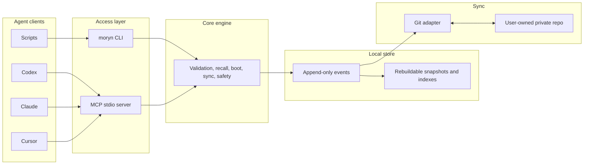

# Moryn


Moryn is a local-first, user-owned, auditable context store and handoff layer
for multi-agent, multi-device AI work.

It gives Codex, Claude, Cursor, Gemini, shell agents, and scripts one durable
context store without making memory belong to any single agent. The user owns
the store. Agents read, write, revise, promote, and hand off context through the
CLI or a real stdio MCP server.

Moryn is not an agent platform, not a vector-memory SDK, and
not a hosted cloud service. It is the memory bus between agents: simple on the
default path, and fully
traceable when a user or agent needs review, provenance, sync, or handoff
history.

> Status: first-version MVP. Local memory operations, Git sync, lifecycle
> handoffs, package smoke tests, and MCP stdio access are implemented.

## Use With An Agent

Moryn is primarily meant to be operated by agents. Most users should not need to
learn the command catalog. Copy this prompt into an agent with shell access:

```text
Install and use Moryn for this project.

Work autonomously: install Moryn if needed, initialize the local store, attach
this repo as a Moryn project, and register `moryn mcp` if this host supports
MCP. Prefer `npm install -g @richardyu114/moryn`; use the source repo at
`https://github.com/Richardyu114/Moryn` only when source development is needed.

Do not ask me to choose Moryn commands. Learn the command surface from
`moryn agent guide` and `moryn contracts operations --index`, then decide when
to call `moryn` yourself. Use Moryn for recall, durable memory, status, sync
when configured, and final handoff.

Ask me only for decisions that require my authority or private information:
sync remote URL, credentials, overwriting or repairing configs, ambiguous
project identity, sensitive memory, sync conflicts, or high-risk canonical
promotion. Never store secrets.
```

For a longer copy-paste prompt and setup expectations, see
[Agent Install Prompt](docs/agent-install-prompt.md).

## Fast Host Adapter Path

For Codex, Claude, Gemini, Cursor, or a shell-based agent, start with the host
adapter path. It keeps Moryn's positioning broad: one user-owned store reused
across multiple agents and devices, not a memory silo for a single host.

```bash
moryn setup --host codex --project . --apply
moryn install --host codex --project . --apply
moryn context pack --project . --agent codex
moryn capture session --project . --agent codex --summary "Finished the task and left handoff notes."
```

`moryn setup` is the one-command local setup wizard. Without `--apply` it is a
dry-run that lists readiness checks and planned actions without writing
anything. With `--apply` it initializes only the Moryn-local store and project
config; it still does not edit host configuration files. `moryn install` remains
the lower-level host adapter plan for MCP registration hints and startup
commands. `moryn context pack` returns Handoff Pack v0.2: a
small handoff index with the current goal, recent decisions, open threads,
risks, user preferences, important files, and next actions, plus the raw boot,
refresh, and handoff evidence it came from. Its read-only `quality_gate`
checks whether key sections, evidence paths, and the required capture action
are present before another agent trusts the pack. It also includes the required
`capture_session` next action. `moryn capture session` evaluates
`default_autocapture_policy` and records an autocapture handoff so the next
agent, host, or device can resume from the same store. Low-risk handoffs are
auto-captured as local handoff evidence without a user click. Handoffs that
mention decisions, risks, blockers, credentials, permissions, or approval enter
the dashboard Capture Inbox as review candidates; obvious smoke/test or
duplicate captures are archived with policy evidence. Nothing becomes canonical
memory without user approval.

## What It Stores

- `memory`: project facts, decisions, warnings, preferences, and active state.
- `skill`: reusable workflows, procedures, and command knowledge.
- `soul`: long-term user preferences, collaboration style, and principles.
- `session_summary`: final handoff notes from one agent session to another.
- `agent_note`: raw agent observations that can later be promoted.

The first version is local-first. `~/.moryn` is the runtime store; a
user-owned private Git repository is the first sync backend.

## Architecture



## Manual Install

From npm:

```bash
npm install -g @richardyu114/moryn
```

From source:

```bash
git clone https://github.com/Richardyu114/Moryn.git
cd Moryn
npm install
npm run build
npm link
```

The executable is `moryn`.

## Agent Command Surface

Agents can discover the current command surface instead of relying on README
examples:

```bash
moryn agent guide
moryn contracts operations --index
moryn contracts operations --operation agent_enter
moryn contracts selection-sources
```

See [Contracts](docs/contracts.md) for operation contracts, selection-source
paths, action templates, and structured recovery metadata.

When recall returns a record but the surrounding history matters, use timeline:

```bash
moryn timeline --record-id rec_... --project-id moryn --before 5 --after 5
```

Timeline can anchor on `--record-id`, `--event-id`, or `--query`. It returns
chronological neighboring events, keyed item maps, and safe `recall` next
actions for fetching full record content. Like other read surfaces, timeline
hides `private`, `secret`, and `sensitive` tagged records by default; pass
`--include-private` only when the user has explicitly asked to inspect private
memory.

When memory quality looks stale, use the read-only doctor:

```bash
moryn memory doctor --project . --limit 20
```

It reports candidate backlog, promotable user-confirmed records, likely
smoke/e2e marker noise, and related records under other project ids. Suggested
promote/archive actions remain `safe_to_run: false` until the user confirms.
The MCP tool name is `memory_doctor`.

When memory has accumulated and needs lifecycle review, use the read-only
lifecycle report:

```bash
moryn memory lifecycle --project . --limit 20
```

It classifies active records as retained, stale, archive candidates, or
private-retained when private reads are explicit. Suggested archive actions
remain `safe_to_run: false`; timeline and recall suggestions are read-only
inspection. The MCP tool name is `memory_lifecycle`.

For Moryn's own dogfood loop, use the read-only report:

```bash
moryn dogfood report --project . --limit 20
```

It reports capture review backlog, duplicate handoff text, and failure or
timeout signals from local records and events. Suggested actions point to
dashboard or timeline inspection and stay `safe_to_run: true` read-only checks.
The MCP tool name is `dogfood_report`.

To audit what the autocapture policy already decided, use the read-only Capture
Policy Audit:

```bash
moryn capture policy --project . --limit 20
```

It explains which autocaptured handoffs require review, which ones were
policy-archived, the matched rule ids, record evidence, and safe dashboard or
timeline inspection actions. It does not approve, reject, promote, or archive
records. The MCP tool name is `capture_policy`.

When the doctor reports split project identity and the canonical id is clear,
preview an auditable migration first:

```bash
moryn project migrate --from repo-e6f0166fd942 --to moryn
moryn project migrate --from repo-e6f0166fd942 --to moryn --apply --confirm
```

The first command is a dry run. The apply form appends `revise_record` events;
private-tagged records are skipped unless `--include-private` is explicit.
The MCP tool name is `project_migrate`.

For browser-mediated review, serve the dashboard with the canonical project id:

```bash
moryn dashboard --serve --host 127.0.0.1 --port 8765 --project-id moryn
```

The local Review Queue shows generated repair plans as decision cards: issue,
impact, recommended action, evidence, rollback path, and an Approve Repair
button. Raw evidence still exposes the dry-run hash, private record counts,
record ids, safety checks, and CLI command. Approval re-runs the plan server
side before writing append-only migration events.

The same live dashboard also shows a Capture Inbox for active review candidate
records. Approve Memory appends a confirmed `promote_record` event to make the
candidate canonical; Reject appends an `archive_record` event. Neither action
rewrites history or silently promotes agent output. Candidates from the same
source/session are grouped for batch review, and likely smoke/test or duplicate
captures are marked as noise. Group actions reduce clicks, but the default
policy remains manual review with no auto-canonical promotion.
`default_autocapture_policy` keeps low-risk handoffs as auto-captured local
handoff evidence, routes risky or durable decisions to Capture Inbox, and
archives obvious smoke/test or duplicate captures before they enter the inbox.
The dashboard exposes auto-captured and policy-archived examples with stable
rule ids. The dashboard also includes the same read-only `capture_policy` audit
report so automatic decisions can be reviewed without creating another mutation
path.

## MCP

Start the MCP server:

```bash
moryn mcp
```

Generic MCP host config:

```json
{
  "mcpServers": {
    "moryn": {
      "command": "moryn",
      "args": ["mcp"]
    }
  }
}
```

Codex CLI:

```bash
codex mcp add moryn -- moryn mcp
```

Gemini CLI:

```bash
gemini mcp add moryn moryn mcp --scope project
```

## Git Sync

Sync is optional and should use a dedicated private repository for Moryn data.
Do not use the source code repository as the memory data store.

```bash
moryn sync init git@github.com:yourname/moryn-store.git
```

Local `config.json`, snapshots, and indexes are not synced. Event history is
the source of truth; derived views can be rebuilt at any time:

```bash
moryn rebuild
```

## Observability Dashboard

Serve a local dashboard when you need a browser view of sync state, records,
recent events, and agent activity as the store changes:

```bash
moryn dashboard --serve --host 127.0.0.1 --port 8765
```

Open `http://127.0.0.1:8765/` on the same machine. To view it from another
device on the same LAN, bind to `0.0.0.0` and open
`http://<machine-ip>:8765/`; firewall and network policy must allow the port.

The server rebuilds dashboard data from local event history on each refresh and
also exposes `/api/dashboard` for JSON inspection. For static inspection,
`moryn dashboard --no-open` writes `state/dashboard/index.html` inside the local
Moryn store; that snapshot is not synced. Interactive lifecycle and sync
commands generate the same static snapshot and open it by default; pass
`--no-open` in automation or when a browser should not be launched. Dashboard
reads also hide `private`, `secret`, and `sensitive` tagged records unless
`--include-private` is passed.

Serve with `--project-id <id>` or `--project <path>` to enable Context Pack
Review. The dashboard then shows read-only handoff readiness under
`context_pack_review`: Handoff Pack v0.2 purpose, recent decisions, open
threads, risks, `handoff_pack.quality_gate`, and the
`next.actions_by_id.capture_session` end action. Without explicit project
context this panel stays unavailable instead of guessing a project.

When `memory doctor` detects a project identity split, the live dashboard can
show a local `Review Queue`. The first interactive repair flow is intentionally
narrow: review the dry-run plan, inspect `plan_hash` and safety checks, then
approve the append-only project migration from the browser. The server re-runs
the dry run before applying and rejects stale approvals.

See [Dashboard](docs/dashboard.md) for endpoints, access modes, and
troubleshooting.

## Safety Model

Moryn separates source material from durable shared memory:

```text
raw -> candidate -> canonical
                 -> archived
                 -> quarantined
```

- `raw`: source material, hidden by default.
- `candidate`: potentially useful, not yet trusted.
- `canonical`: durable context returned by default.
- `archived`: preserved history, hidden by default.
- `quarantined`: sensitive or unsafe content, hidden by default.

The dashboard Capture Inbox is the default human review path only for
autocaptured handoffs that need a user decision. Low-risk handoffs remain
auto-captured local evidence for context packs without becoming canonical.
Grouped approve and reject actions are batch user decisions, not background
promotion rules. The read-only `capture_policy` report explains automatic
capture/review/archive routing but does not mutate memory.

Records tagged `private`, `secret`, or `sensitive` are active records, but they
are excluded from normal `boot`, `recall`, `refresh`, `list-recent`, `timeline`,
`memory doctor`, `memory lifecycle`, `capture policy`, `dogfood report`, and
dashboard reads. Use `--include-private` or MCP `include_private: true` only
with explicit user intent. Sensitive content is quarantined or redacted before
it enters normal recall. High-risk canonical writes require explicit
confirmation.

## Documentation

- [Agent Install Prompt](docs/agent-install-prompt.md)
- [Agent Workflow](docs/agent-workflow.md)
- [Contracts](docs/contracts.md)
- [Dashboard](docs/dashboard.md)
- [Development](docs/development.md)
- [Design Spec](docs/moryn-design.md)
- [Implementation Roadmap](docs/implementation-roadmap.md)

## Development

```bash
npm install
npm run build
npm run typecheck
npm test
npm run release:check
npm run smoke:agent-lifecycle
```

The release check builds, typechecks, tests, checks packed-package contents, and
optionally validates a private Git remote:

```bash
MORYN_PRIVATE_GIT_REMOTE=git@github.com:yourname/moryn-store-release-test.git npm run release:check
```

Use a dedicated test data repo for release validation. The validation writes a
test event to the remote.

## License

MIT
