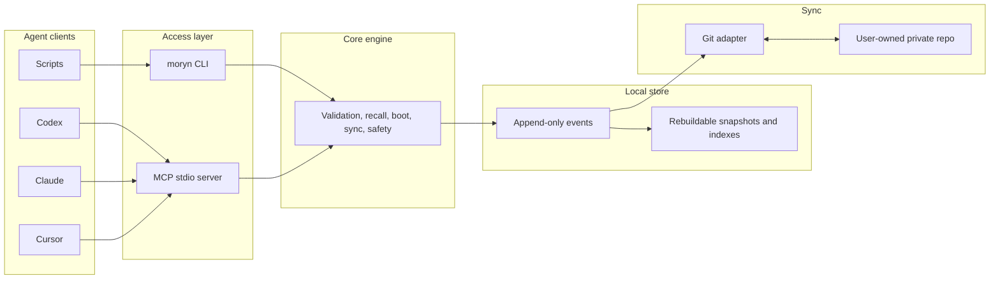

# Moryn


Moryn is a local-first memory, skill, and handoff layer for AI agents.

It gives Codex, Claude, Cursor, Gemini, shell agents, and scripts one durable
context store without making memory belong to any single agent. The user owns
the store. Agents read, write, revise, promote, and hand off context through the
CLI or a real stdio MCP server.

> Status: first-version MVP. Local memory operations, Git sync, lifecycle
> handoffs, package smoke tests, and MCP stdio access are implemented.

## What It Stores

- `memory`: project facts, decisions, warnings, preferences, and active state.
- `skill`: reusable workflows, procedures, and command knowledge.
- `soul`: long-term user preferences, collaboration style, and principles.
- `session_summary`: final handoff notes from one agent session to another.
- `agent_note`: raw agent observations that can later be promoted.

The first version is local-first. `~/.moryn` is the runtime store; a
user-owned private Git repository is the first sync backend.

## Architecture



## Install

From source:

```bash
git clone git@github.com:Richardyu114/Moryn.git
cd Moryn
npm install
npm run build
npm link
```

After npm publication:

```bash
npm install -g @richardyu114/moryn
```

The executable is `moryn`.

## Quick Start

Initialize the local store:

```bash
moryn init
```

Initialize a project:

```bash
cd /path/to/project
moryn project init --project-id my-project --tag typescript --default-skill release
```

Write a project decision:

```bash
moryn write \
  --kind memory \
  --type decision \
  --scope project \
  --project . \
  --state canonical \
  --text "Use append-only events as the source of truth."
```

Recall it later:

```bash
moryn recall "append-only events" --project .
```

Boot an agent context:

```bash
moryn boot --project . --current-task "ship the release"
```

## Agent Lifecycle

Agents should usually start with `agent enter`. It diagnoses setup, discovers
known projects when needed, or starts the known project session directly.

```bash
moryn agent enter \
  --project . \
  --sync-remote git@github.com:yourname/moryn-store.git \
  --current-task "current task" \
  --agent codex
```

During meaningful work, publish status:

```bash
moryn agent status \
  --project . \
  --sync-remote git@github.com:yourname/moryn-store.git \
  --current-task "current task" \
  --agent codex \
  --status "Currently tracing the failing release check."
```

At the end, write a handoff:

```bash
moryn agent finish \
  --project . \
  --sync-remote git@github.com:yourname/moryn-store.git \
  --agent codex \
  --summary "Finished the release check cleanup and left follow-up notes."
```

For setup diagnostics without writes:

```bash
moryn agent doctor --project . --sync-remote git@github.com:yourname/moryn-store.git
```

See [Agent Workflow](docs/agent-workflow.md) for lifecycle details, handoff
semantics, recovery actions, and smoke tests.

## MCP

Start the MCP server:

```bash
moryn mcp
```

Configure an MCP host to run:

```json
{
  "mcpServers": {
    "moryn": {
      "command": "moryn",
      "args": ["mcp"]
    }
  }
}
```

Codex CLI example:

```bash
codex mcp add moryn -- moryn mcp
```

Gemini CLI example:

```bash
gemini mcp add moryn moryn mcp --scope project
```

The MCP server exposes the same core operations as the CLI, including `boot`,
`recall`, `write`, `revise`, `promote`, `archive`, `quarantine`, `link`,
`refresh`, `rebuild`, `sync_*`, `project_*`, and agent lifecycle tools.

## Git Sync

Connect a private sync repo:

```bash
moryn sync init git@github.com:yourname/moryn-store.git
```

Use a dedicated private repository for Moryn data. Do not use the source code
repository as the data store.

```bash
moryn sync --status
moryn sync --pull
moryn sync --push --message "sync after session"
```

Local `config.json`, snapshots, and indexes are not synced. Event history is
the source of truth; derived views can be rebuilt at any time:

```bash
moryn rebuild
```

## Command Overview

```bash
moryn init
moryn project init
moryn project list
moryn agent guide
moryn agent enter
moryn agent doctor
moryn agent start
moryn agent status
moryn agent finish
moryn boot
moryn recall
moryn write
moryn revise
moryn promote
moryn archive
moryn quarantine
moryn link
moryn list-recent
moryn refresh
moryn rebuild
moryn sync init <remote>
moryn sync --status
moryn sync --pull
moryn sync --push
moryn contracts operations
moryn contracts selection-sources
moryn mcp
```

For machine-readable command metadata:

```bash
moryn contracts operations --index
moryn contracts operations --operation agent_enter
moryn contracts selection-sources
```

See [Contracts](docs/contracts.md) for operation contracts, selection-source
paths, action templates, and structured recovery metadata.

## Safety Model

Moryn separates source material from durable shared memory:

```text
raw -> candidate -> canonical
                 -> archived
                 -> quarantined
```

- `raw`: source material, hidden by default.
- `candidate`: potentially useful, not yet trusted.
- `canonical`: durable context returned by default.
- `archived`: preserved history, hidden by default.
- `quarantined`: sensitive or unsafe content, hidden by default.

Sensitive content is quarantined or redacted before it enters normal recall.
High-risk canonical writes require explicit confirmation.

## Documentation

- [Agent Workflow](docs/agent-workflow.md)
- [Contracts](docs/contracts.md)
- [Development](docs/development.md)
- [Design Spec](docs/moryn-design.md)
- [Implementation Roadmap](docs/implementation-roadmap.md)

## Development

```bash
npm install
npm run build
npm run typecheck
npm test
npm run release:check
npm run smoke:agent-lifecycle
```

The release check builds, typechecks, tests, checks packed-package contents, and
optionally validates a private Git remote:

```bash
MORYN_PRIVATE_GIT_REMOTE=git@github.com:yourname/moryn-store-release-test.git npm run release:check
```

Use a dedicated test data repo for release validation. The validation writes a
test event to the remote.

## License

MIT
