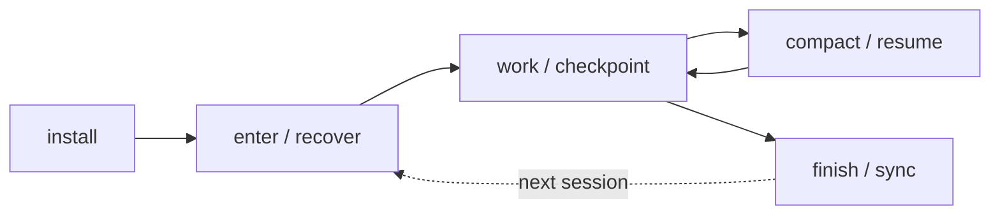
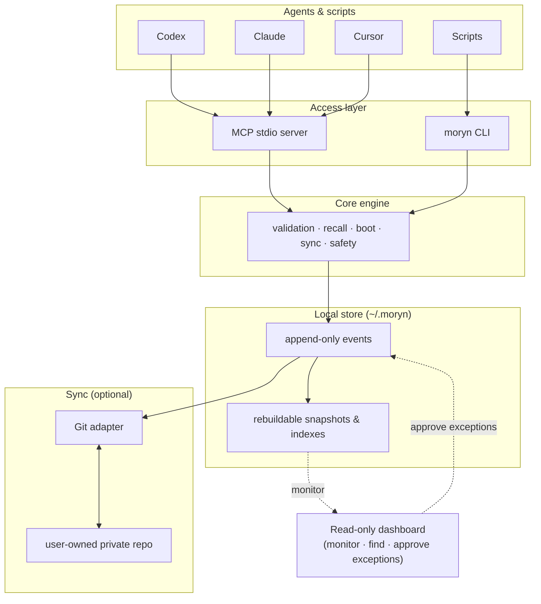

# Moryn


**Moryn is a local-first, user-owned context store and handoff layer for
multi-agent, multi-device AI work.**

Codex, Claude, Cursor, Gemini, shell agents, and scripts share one durable
context store — without memory belonging to any single agent. The user owns the
store. Agents recall context, hand work to the next agent, sync through a
user-owned private Git repo, and every saved item shows exactly where it came
from.

Moryn is **not** an agent platform, a vector-memory SDK, or a hosted cloud
service. It is the *memory bus between agents*: simple on the default path, and
fully traceable when someone needs review, provenance, sync, or handoff history.

> **Status:** npm package `v0.2.0`. The development branch is building the
> **v0.3 Context Autopilot** lifecycle for Codex and Claude Code — not released
> until the version, changelog, and release process are updated explicitly.

---

## How it works

The default path is **agent-operated**. An agent enters a project, recalls
bounded context, checkpoints before its context window compacts, restores the
task afterward, captures reliable learnings, and finishes with a synchronized
handoff.



You mostly don't touch the commands — you ask an agent to operate Moryn. The
dashboard stays a **quiet, read-only monitor** (health, current context, memory
flow, sync state, audit evidence). You step in only for exceptions: credentials
or private config, unresolved sync conflicts, sensitive content, ambiguous
project identity, or materially conflicting long-term memory.

## Quick start

**Use it with an agent (recommended).** Paste this into any agent with shell
access:

```text
Install and use Moryn for this project.

Work autonomously: install Moryn if needed, initialize the local store, attach
this repo as a Moryn project, and register `moryn mcp` if this host supports
MCP. Prefer `npm install -g @richardyu114/moryn`; use the source repo at
https://github.com/Richardyu114/Moryn only when source development is needed.

Do not ask me to choose Moryn commands. Learn the command surface from
`moryn agent guide` and `moryn contracts operations --index`, then decide when
to call `moryn` yourself. Use Moryn for recall, durable memory, status, sync
when configured, and final handoff.

Ask me only for decisions that require my authority or private information:
sync remote URL, credentials, overwriting or repairing configs, ambiguous
project identity, sensitive memory, sync conflicts, or making high-risk memory
long term. Never store secrets.
```

A longer prompt and setup expectations live in
[Agent Install Prompt](docs/agent-install-prompt.md).

**Try the demo** from a source checkout — neither smoke touches your real store:

```bash
npm run smoke:dogfood-demo     # storage, context, capture policy, dashboard
npm run smoke:agent-lifecycle  # the full v0.3 Autopilot lifecycle
```

**Install manually:**

```bash
npm install -g @richardyu114/moryn        # from npm
# or from source:
git clone https://github.com/Richardyu114/Moryn.git
cd Moryn && npm install && npm run build && npm link
```

The executable is `moryn`.

## What it stores

| Kind | What it holds |
| --- | --- |
| `memory` | project facts, decisions, warnings, preferences, active state |
| `skill` | reusable workflows, procedures, command knowledge |
| `soul` | long-term user preferences, collaboration style, principles |
| `session_summary` | final handoff notes from one agent session to the next |
| `agent_note` | raw agent observations that can later be promoted |

Local-first: `~/.moryn` is the runtime store; a user-owned private Git repo is
the first sync backend.

## Architecture



Event history is the source of truth. Snapshots and indexes are derived and can
be rebuilt at any time with `moryn rebuild`.

## Safety model

Records move through explicit states, so source material never silently becomes
trusted shared memory:

```text
raw ──> candidate ──> canonical
                  └──> archived
                  └──> quarantined
```

- `raw` — source material, hidden by default
- `candidate` — potentially useful, not yet trusted
- `canonical` — durable context, returned by default
- `archived` — preserved history, hidden by default
- `quarantined` — sensitive or unsafe, hidden by default

Records tagged `private`, `secret`, or `sensitive` are excluded from normal
reads (`boot`, `recall`, `refresh`, `timeline`, doctor/lifecycle reports, and
the dashboard). Pass `--include-private` (or MCP `include_private: true`) only
with explicit user intent. High-risk canonical writes require confirmation.

**Capture Inbox** is the exceptional human-review path. Low-risk handoffs are
auto-captured as local evidence without a click; risky or durable decisions go
to the inbox for approve/reject; obvious smoke/test or duplicate captures are
archived with policy evidence. Nothing rewrites history or silently promotes
agent output.

## Connecting agents (MCP)

```bash
moryn mcp                                  # start the stdio server
codex mcp add moryn -- moryn mcp           # Codex CLI
gemini mcp add moryn moryn mcp --scope project  # Gemini CLI
```

Generic MCP host config:

```json
{ "mcpServers": { "moryn": { "command": "moryn", "args": ["mcp"] } } }
```

Codex and Claude Code are the validated v0.3 Autopilot integrations; other hosts
use MCP plus explicit lifecycle commands. See
[Agent Workflow](docs/agent-workflow.md) for the full lifecycle.

## Git sync

Sync is optional and must use a **dedicated private repo** — never the source
code repo:

```bash
moryn sync init git@github.com:yourname/moryn-store.git
```

`config.json`, snapshots, and indexes are not synced; event history is the
source of truth and derived views rebuild via `moryn rebuild`.

## Dashboard

A local, read-only browser view of sync state, records, recent events, and agent
activity:

```bash
moryn dashboard --serve --host 127.0.0.1 --port 8765 --project-id moryn
```

It rebuilds from event history on each refresh and also exposes `/api/dashboard`
(JSON). `moryn dashboard --no-open` writes a static
`state/dashboard/index.html` snapshot (not synced). When a project is set, it
adds read-only handoff-readiness (Context Pack Review) and, for exceptional
cases, a local Review Queue and Capture Inbox for approving append-only repair,
migration, or promotion events. Full details:
[Dashboard](docs/dashboard.md).

## Command surface

Agents should discover commands at runtime rather than memorize them:

```bash
moryn agent guide
moryn contracts operations --index
moryn contracts operations --operation agent_enter
moryn contracts selection-sources
```

The read-only inspection commands (all safe, none mutate memory):

| Command | Purpose |
| --- | --- |
| `moryn timeline --record-id <id>` | chronological neighbors + recall next actions |
| `moryn memory doctor` | candidate backlog, promotable records, marker noise, split project ids |
| `moryn memory lifecycle` | classify records: retained / stale / archive candidate |
| `moryn capture policy` | audit what autocapture already decided |
| `moryn dogfood report` | capture backlog, duplicate handoffs, failure/timeout signals |
| `moryn health check` | store readiness, replay, project context, MCP freshness |
| `moryn eval recall` | recall quality against golden queries |
| `moryn project migrate` | preview + apply auditable project-id migration |

Suggested mutating actions stay `safe_to_run: false` until you confirm. Each has
a matching MCP tool. See [Contracts](docs/contracts.md) for operation contracts,
selection-source paths, and recovery metadata.

## Documentation

- [Agent Install Prompt](docs/agent-install-prompt.md) — copy-paste setup
- [Agent Workflow](docs/agent-workflow.md) — the lifecycle protocol
- [Dashboard](docs/dashboard.md) — endpoints, access modes, troubleshooting
- [Contracts](docs/contracts.md) — machine-readable operation contracts
- [Design Spec](docs/moryn-design.md) — full protocol design
- [Implementation Roadmap](docs/implementation-roadmap.md)
- [Development](docs/development.md) · [Changelog](CHANGELOG.md)

## Development

```bash
npm install
npm run build
npm run typecheck
npm test
npm run release:check
```

The smoke suite covers the acceptance paths — Autopilot lifecycle, dogfood loop,
v0.2 upgrade compatibility, and sync/permission resilience:

```bash
npm run smoke:agent-lifecycle       # v0.3 Autopilot acceptance
npm run smoke:dogfood-demo          # setup, context-pack, policy, dashboard
npm run smoke:upgrade-compat        # open a frozen v0.2 store in place
npm run smoke:sync-resilience       # remote outage never loses the handoff
npm run smoke:sync-conflict         # real Git conflict halts and waits for human
npm run smoke:permission-recovery   # auth failure stays local-first, resumes later
```

`release:check` builds, typechecks, tests, checks packed-package contents, and
optionally validates a private Git remote:

```bash
MORYN_PRIVATE_GIT_REMOTE=git@github.com:yourname/moryn-store-release-test.git npm run release:check
```

Use a dedicated test data repo — validation writes a test event to the remote.
More detail: [Development](docs/development.md).

## License

MIT
