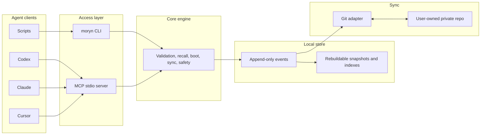

# Moryn


Moryn is a local-first memory, skill, and handoff layer for AI agents.

It gives Codex, Claude, Cursor, Gemini, shell agents, and scripts one durable
context store without making memory belong to any single agent. The user owns
the store. Agents read, write, revise, promote, and hand off context through the
CLI or a real stdio MCP server.

> Status: first-version MVP. Local memory operations, Git sync, lifecycle
> handoffs, package smoke tests, and MCP stdio access are implemented.

## Use With An Agent

Moryn is primarily meant to be operated by agents. Most users should not need to
learn the command catalog. Copy this prompt into an agent with shell access:

```text
Install and use Moryn for this project.

Work autonomously: install Moryn if needed, initialize the local store, attach
this repo as a Moryn project, and register `moryn mcp` if this host supports
MCP. Prefer `npm install -g @richardyu114/moryn`; use the source repo at
`https://github.com/Richardyu114/Moryn` only when source development is needed.

Do not ask me to choose Moryn commands. Learn the command surface from
`moryn agent guide` and `moryn contracts operations --index`, then decide when
to call `moryn` yourself. Use Moryn for recall, durable memory, status, sync
when configured, and final handoff.

Ask me only for decisions that require my authority or private information:
sync remote URL, credentials, overwriting or repairing configs, ambiguous
project identity, sensitive memory, sync conflicts, or high-risk canonical
promotion. Never store secrets.
```

For a longer copy-paste prompt and setup expectations, see
[Agent Install Prompt](docs/agent-install-prompt.md).

## What It Stores

- `memory`: project facts, decisions, warnings, preferences, and active state.
- `skill`: reusable workflows, procedures, and command knowledge.
- `soul`: long-term user preferences, collaboration style, and principles.
- `session_summary`: final handoff notes from one agent session to another.
- `agent_note`: raw agent observations that can later be promoted.

The first version is local-first. `~/.moryn` is the runtime store; a
user-owned private Git repository is the first sync backend.

## Architecture



## Manual Install

From npm:

```bash
npm install -g @richardyu114/moryn
```

From source:

```bash
git clone https://github.com/Richardyu114/Moryn.git
cd Moryn
npm install
npm run build
npm link
```

The executable is `moryn`.

## Agent Command Surface

Agents can discover the current command surface instead of relying on README
examples:

```bash
moryn agent guide
moryn contracts operations --index
moryn contracts operations --operation agent_enter
moryn contracts selection-sources
```

See [Contracts](docs/contracts.md) for operation contracts, selection-source
paths, action templates, and structured recovery metadata.

When recall returns a record but the surrounding history matters, use timeline:

```bash
moryn timeline --record-id rec_... --project-id moryn --before 5 --after 5
```

Timeline can anchor on `--record-id`, `--event-id`, or `--query`. It returns
chronological neighboring events, keyed item maps, and safe `recall` next
actions for fetching full record content. Like other read surfaces, timeline
hides `private`, `secret`, and `sensitive` tagged records by default; pass
`--include-private` only when the user has explicitly asked to inspect private
memory.

## MCP

Start the MCP server:

```bash
moryn mcp
```

Generic MCP host config:

```json
{
  "mcpServers": {
    "moryn": {
      "command": "moryn",
      "args": ["mcp"]
    }
  }
}
```

Codex CLI:

```bash
codex mcp add moryn -- moryn mcp
```

Gemini CLI:

```bash
gemini mcp add moryn moryn mcp --scope project
```

## Git Sync

Sync is optional and should use a dedicated private repository for Moryn data.
Do not use the source code repository as the memory data store.

```bash
moryn sync init git@github.com:yourname/moryn-store.git
```

Local `config.json`, snapshots, and indexes are not synced. Event history is
the source of truth; derived views can be rebuilt at any time:

```bash
moryn rebuild
```

## Observability Dashboard

Serve a local dashboard when you need a browser view of sync state, records,
recent events, and agent activity as the store changes:

```bash
moryn dashboard --serve --host 127.0.0.1 --port 8765
```

Open `http://127.0.0.1:8765/` on the same machine. To view it from another
device on the same LAN, bind to `0.0.0.0` and open
`http://<machine-ip>:8765/`; firewall and network policy must allow the port.

The server rebuilds dashboard data from local event history on each refresh and
also exposes `/api/dashboard` for JSON inspection. For static inspection,
`moryn dashboard --no-open` writes `state/dashboard/index.html` inside the local
Moryn store; that snapshot is not synced. Interactive lifecycle and sync
commands generate the same static snapshot and open it by default; pass
`--no-open` in automation or when a browser should not be launched. Dashboard
reads also hide `private`, `secret`, and `sensitive` tagged records unless
`--include-private` is passed.

See [Dashboard](docs/dashboard.md) for endpoints, access modes, and
troubleshooting.

## Safety Model

Moryn separates source material from durable shared memory:

```text
raw -> candidate -> canonical
                 -> archived
                 -> quarantined
```

- `raw`: source material, hidden by default.
- `candidate`: potentially useful, not yet trusted.
- `canonical`: durable context returned by default.
- `archived`: preserved history, hidden by default.
- `quarantined`: sensitive or unsafe content, hidden by default.

Records tagged `private`, `secret`, or `sensitive` are active records, but they
are excluded from normal `boot`, `recall`, `refresh`, `list-recent`, `timeline`,
and dashboard reads. Use `--include-private` or MCP `include_private: true`
only with explicit user intent. Sensitive content is quarantined or redacted
before it enters normal recall. High-risk canonical writes require explicit
confirmation.

## Documentation

- [Agent Install Prompt](docs/agent-install-prompt.md)
- [Agent Workflow](docs/agent-workflow.md)
- [Contracts](docs/contracts.md)
- [Dashboard](docs/dashboard.md)
- [Development](docs/development.md)
- [Design Spec](docs/moryn-design.md)
- [Implementation Roadmap](docs/implementation-roadmap.md)

## Development

```bash
npm install
npm run build
npm run typecheck
npm test
npm run release:check
npm run smoke:agent-lifecycle
```

The release check builds, typechecks, tests, checks packed-package contents, and
optionally validates a private Git remote:

```bash
MORYN_PRIVATE_GIT_REMOTE=git@github.com:yourname/moryn-store-release-test.git npm run release:check
```

Use a dedicated test data repo for release validation. The validation writes a
test event to the remote.

## License

MIT
